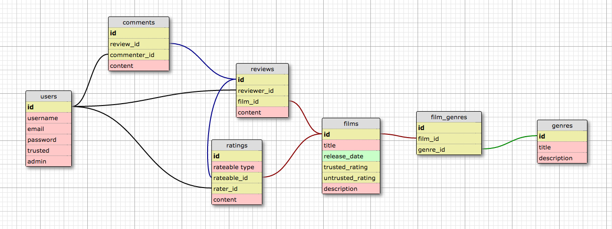

### Take-2-Film-Reviews
  - Take-2-Film-Reviews is an application showcasing films which allows members
to create reviews for films. In addition to creating a review on a film, a
member also has the ability to rate a movie "good" or "bad", as well as place
a comment on a review that has been previously been made. Non members of
the application have the ability to see movie posters and descriptions as
well as see reviews and comments that have been made. Becoming a member of
the application is as simple as filling in a form with a few credentials. If
you are planning to join, and you are a member of another professional
film review publication, make sure to sign up with your industry email
domain to receive 'trusted reviewer' status. Enjoy.

### Team members
- Greg: <a href="https://github.com/gptasinski">github.com/gptasinski</a>
- Larissa: : <a href="https://github.com/trodicaro">github.com/trodicaro</a>
- Rodica: : <a href="https://github.com/MsLarissaaa">github.com/MsLarissaaa</a>
- Application live at: http://take2moviereview.herokuapp.com/

### Database Schema

### Signup / Login
- As a user I want to be able to sign up so I can have access to full functionality of the app.
- As a user I want to be able to choose an institution on sign up to be signed in as a trusted reviewer.
- As a user I want to be able to log in into my account.
- As a user I want to see a link to log out at the top of the page when I am logged in.

### Films Index
- As a user I want to be able to see all the films on the site without being logged in, by rating, best to worst.
- As a user I want to be able to see all the films on the site without being logged in, by release date.
- As a user I want to be able to see all the films on the site without being logged in, by genre.
- As a user I want to be able to see the most recent reviews in a sidebar without being logged in.
- As a user I want to be able to see all the films on the site while being logged in, by rating, best to worst.
- As a user I want to be able to see all the films on the site while while logged in, by release date.
- As a user I want to be able to see all the films on the site while while logged in, by genre.
- As a user I want to be able to see the most recent reviews in a sidebar while being logged in.

### Films Show
- As a logged in user I want to be able to create a review for a film.
- As a logged in user I want to be able to post comments on film reviews.
- As a user I should be able to rate a review when logged in.
- As a user I should be able to rate a film when logged in.
- As a non-logged in user I should not see links for creating reviews or comments.
- As a non-looged in user I should not be able to vote on reviews or films.

### Stretch
- As a user I want to see a link to my profile on the home page.
